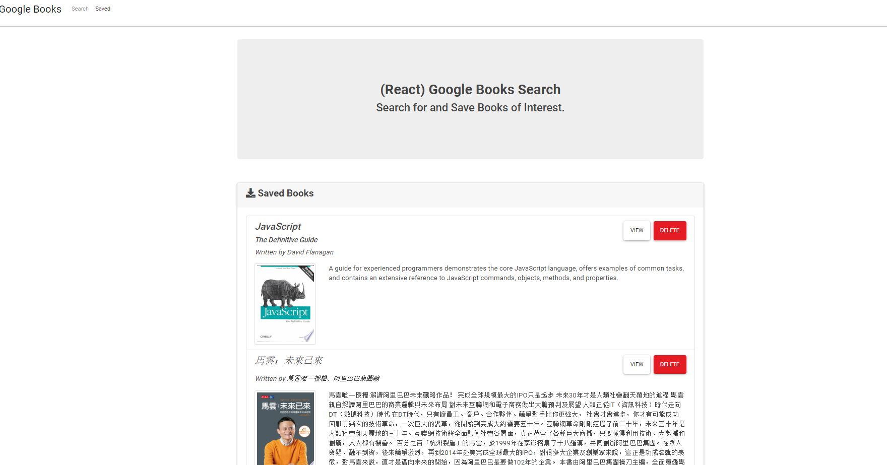

# Google Books Search

## Badges


## License

Copyright 2020 - Max Guo. Code released under the MIT license.

## User Story
```
As A USER, 
I want to be able to search books using google books API and save books for later review
```
## Table of Content

* [Description](#Description)
* [Demo](#Demo)
* [Contributing](#Contributing)
* [Reference](#Reference)


## Description

User will be able to use this app to search and store books. 
This application is built using: Node, Express and MongoDB.


## Demo


Demo Link : https://evening-fortress-63160.herokuapp.com/

## Contributing

Max, github: https://github.com/Maxguojiaqi/Employee-Directory

## Reference
React: https://reactjs.org/
Express: https://expressjs.com/
MongoDB: https://www.mongodb.com/
Axios: https://www.npmjs.com/package/axios